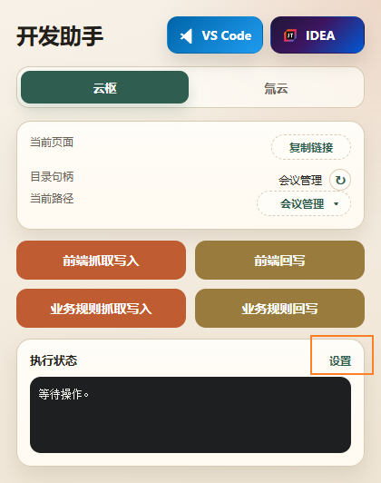
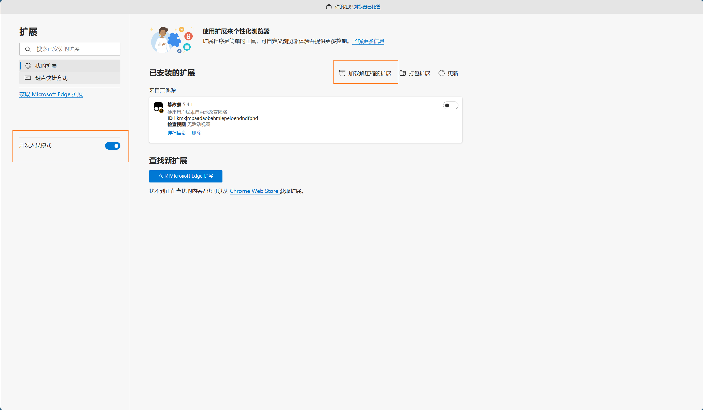
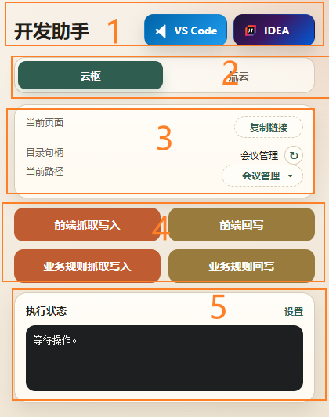
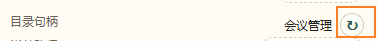
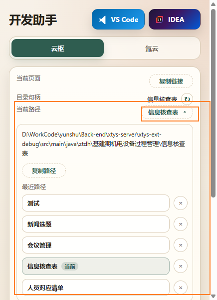

# 开发助手（CloudPiOvt Plugin）使用手册

## 目录

1. [概述](#1-概述)
2. [安装与前置条件](#2-安装与前置条件)
3. [弹窗界面总览](#3-弹窗界面总览)
4. [目录管理](#4-目录管理)
5. [云枢平台](#5-云枢平台)
6. [氚云平台](#6-氚云平台)
7. [设置页](#7-设置页)
8. [Edge 浏览器补充说明](#8-edge-浏览器补充说明)
9. [常见问题](#9-常见问题)

---

## 1. 概述

开发助手是一款 Chrome/Edge 浏览器扩展，为**云枢**和**氚云**两个低代码平台的在线开发页面提供本地代码抓取、回写和目录协作能力。

| 项目 | 说明 |
|------|------|
| 扩展名称 | 开发助手 |
| 版本 | 1.0.0 |
| 平台支持 | 云枢（CloudPivot）、氚云（H3Yun） |
| 浏览器支持 | Chrome、Edge（Manifest V3） |

核心功能：

- **云枢**：前端代码（HTML/CSS/JS）抓取写入与回写、业务规则（Java）抓取写入与回写
- **氚云**：图形控件 + 前端 JS + 后端 C# 一键抓取写入，前端/后端独立回写
- **编辑器启动**：一键用 VS Code 或 IDEA 打开当前绑定目录
- **目录管理**：按页面类型独立绑定本地目标目录，支持最近路径历史


---

## 2. 安装与前置条件

### 2.1 Chrome 浏览器安装

#### 2.1.1 安装扩展

1. 打开 Chrome 浏览器，进入 `chrome://extensions`
2. 开启右上角「开发人员模式」
3. 点击「加载已解压的扩展程序」，选择 `cloudpiovt-plugin` 文件夹
4. 扩展安装完成后，工具栏会出现「开发助手」图标


#### 2.1.2 安装 Native Messaging Host（Chrome）

以管理员身份运行 PowerShell，执行：

```powershell
pwsh .\scripts\install-native-host.ps1 -Browser chrome
```

或使用默认安装命令（同时注册 Chrome 和 Edge）：

```powershell
pwsh .\scripts\install-native-host.ps1 -Browser all
```

安装成功后，扩展设置页的「运行状态」区域会显示「原生助手已连接」。




### 2.2 Edge 浏览器安装

#### 2.2.1 安装扩展

1. 打开 Edge 浏览器，进入 `edge://extensions`
2. 开启左下角「开发人员模式」
3. 点击「加载解压缩的扩展」，选择 `cloudpiovt-plugin` 文件夹
4. 扩展安装完成后，工具栏会出现「开发助手」图标



#### 2.2.2 获取 Edge 扩展 ID

安装扩展后，在 `edge://extensions` 页面找到「开发助手」，复制其扩展 ID（格式如 `abcdefghijklmnopqrstuvwxyz123456`）。


#### 2.2.3 安装 Native Messaging Host（Edge）

以管理员身份运行 PowerShell，执行：

```powershell
pwsh .\scripts\install-native-host.ps1 -Browser edge -ExtensionId <Edge扩展ID>
```

将 `<Edge扩展ID>` 替换为实际复制的 ID。

> **注意**：Edge 扩展 ID 与 Chrome 不同，必须单独注册。如果使用默认 `-Browser all` 安装，Edge 可能仍显示「原生助手未连接」，此时需要按此步骤重新注册。

#### 2.2.4 验证连接

安装完成后，打开扩展设置页，查看「运行状态」区域是否显示「原生助手已连接」。

### 2.3 双浏览器使用说明

| 场景 | 操作建议 |
|------|----------|
| 仅使用 Chrome | 执行 `-Browser chrome` 或 `-Browser all` 即可 |
| 仅使用 Edge | 执行 `-Browser edge -ExtensionId <ID>` |
| 同时使用 Chrome 和 Edge | 先执行 `-Browser all`，再为 Edge 单独执行 `-Browser edge -ExtensionId <ID>` |

> **原理说明**：Chrome 与 Edge 共用同一个 Native Host 可执行文件（`CloudPiOvt.NativeHost.exe`），但浏览器分别从不同的注册表路径查找 host manifest：
> - Chrome：`HKCU\Software\Google\Chrome\NativeMessagingHosts`
> - Edge：`HKCU\Software\Microsoft\Edge\NativeMessagingHosts`
> 
> host manifest 中的 `allowed_origins` 必须列出实际调用扩展的 `chrome-extension://<扩展ID>/` 来源。由于 Chrome 和 Edge 的扩展 ID 不同，需要分别注册。

---

## 3. 弹窗界面总览

点击浏览器工具栏的「开发助手」图标，弹出操作面板。弹窗主要分为以下几个区域：

| 区域 | 说明 |
|------|------|
| 顶部标题栏 | 显示扩展名称，提供 VS Code / IDEA 一键打开按钮 |
| 平台标签页 | 「云枢」和「氚云」两个标签，按当前页面平台自动切换 |
| 页面信息卡片 | 显示当前页面地址、目录句柄状态、当前路径及最近路径历史 |
| 操作按钮区 | 根据所选平台显示不同的抓取/回写按钮 |
| 执行状态区 | 显示最近一次操作的状态日志，提供「设置」入口 |



### 3.1 VS Code / IDEA 一键打开

在设置页配置好 VS Code 或 IDEA 的可执行文件路径后，点击弹窗顶部的对应按钮，即可用该编辑器打开当前页面绑定的目标目录。


---

## 4. 目录管理

### 4.1 目录绑定机制

插件使用两层目录状态管理：

- **全局默认值**：按页面类型（表单/列表/默认/氚云表单）保存在浏览器存储中，供后续新打开的页面建立初始目录
- **页面快照**：按当前标签页独立保存目录绑定，已打开的页面不会被后续默认值变更影响

简单理解：选择一个目录后，当前页面和以后新打开的同类页面都会使用该目录，但之前已打开的老页面继续使用各自原来的目录。

### 4.2 选择目标目录

1. 在目标平台页面（云枢在线开发或氚云表单设计页）打开弹窗
2. 点击「目录句柄」旁边的刷新按钮 **↻**
3. 在弹出的系统文件夹选择对话框中选择本地开发目录
4. 选择成功后，「当前路径」区域会更新为所选目录



### 4.3 最近路径

「当前路径」区域支持展开/收起：

- **收起状态**：只显示最终目标文件夹名称
- **展开状态**：显示完整绝对路径，可点击复制；展示最近使用的路径历史列表，点击可快速切换

移除历史记录只会删除快捷入口，不会清空当前页面已经绑定的目标目录。



---

## 5. 云枢平台

当用户在云枢平台的在线开发页面（form-design / list-design）打开弹窗时，自动显示「云枢」标签。

### 5.1 页面类型识别

| 页面 URL 特征 | 页面类型 | 生成文件 |
|--------------|---------|----------|
| `form-design` | 表单在线开发 | `form-index.html` / `form-style.css` / `form-script.js` |
| `list-design` | 列表在线开发 | `list-index.html` / `list-style.css` / `list-script.js` |
| 其他 | 默认页面 | `index.html` / `style.css` / `script.js` |

### 5.2 前端抓取写入

**使用场景**：在云枢「在线开发」页面抓取当前表单/列表的前端代码（HTML/CSS/JS）到本地目录。

**操作步骤**：

1. 打开云枢表单或列表的「在线开发」页面
2. 确保已为目标页面绑定本地目录（参见 [4.2 选择目标目录](#42-选择目标目录)）
3. 点击弹窗中的「**前端抓取写入**」按钮
4. 插件自动抓取页面中 `data.codes` 的 HTML/CSS/JS 内容，按页面类型写入对应文件


**自动生成的文档文件**：

| 文件 | 说明 |
|------|------|
| `README.MD` | 空白占位文件，供人工补充页面说明；已存在时不会被覆盖 |
| `FromCode.md` | 控件编码文档，包含应用编码、表单编码、控件编码、控件类型、子表编码等；每次抓取同步刷新 |

`FromCode.md` 会为每个控件记录以下信息：

- 控件编码
- 控件类型（单行文本/长文本/日期/数值/单选框/复选框/下拉单选框/下拉多选框/附件/图片/人员选择等）
- 对于单选框/复选框/下拉框：提取 `data-options` 中的中文控件选项
- 对于关联单选/关联多选：额外保留「关联表单编码 / 关联表单名称」


### 5.3 前端回写

将本地修改后的 HTML/CSS/JS 文件内容写回云枢在线编辑器的 `data.codes`。

**操作步骤**：

1. 在本地编辑器中修改对应的前端文件
2. 确保当前页面仍是同一个在线开发页面
3. 点击弹窗中的「**前端回写**」按钮

### 5.4 业务规则抓取写入

**使用场景**：抓取云枢业务规则开发页面中的 Java 源代码到本地 `.java` 文件。

**限制**：同一页面同时只支持一个业务规则编辑器。若同时打开了多个不同表单或多个业务规则，请先关闭多余的再抓取。

**操作步骤**：

1. 进入云枢业务规则开发页面
2. 绑定本地目录
3. 点击弹窗中的「**业务规则抓取写入**」按钮
4. 插件通过 Monaco API 读取当前 Java 源码，按 model URI 或类名写入 `.java` 文件


### 5.5 业务规则回写

将本地修改后的 `.java` 文件内容写回业务规则编辑器。

**操作步骤**：

1. 在本地编辑器中修改 `.java` 文件
2. 确保当前页面仍是同一个业务规则编辑页面（且仅打开一个业务规则）
3. 点击弹窗中的「**业务规则回写**」按钮

---

## 6. 氚云平台

当用户在 `h3yun.com` 或其子域名的表单设计页面打开弹窗时，自动显示「氚云」标签。

### 6.1 氚云独立策略

氚云和云枢设计器结构不同，**不会复用**云枢的 `data.codes` 或 Monaco 业务规则抓取逻辑。氚云使用独立的：

- 图形控件扫描（`.designer.web .control-container[data-code]`）
- 前端 JS 抓取（`#jsText` Monaco model）
- 后端 C# 抓取（`#csText` Monaco model）
- 独立页面类型和目录快照

### 6.2 一键抓取写入

点击「**一键抓取写入**」按钮，插件会同时抓取三类内容：

| 来源 | 目标文件 | 说明 |
|------|---------|------|
| 图形设计页控件 | `FromCode.md` | 控件编码、控件类型、中文名称；子表控件额外输出子控件 |
| 前端代码编辑器 `#jsText` | `{表单ID}.js` | 按表单对象 ID 命名 |
| 后端代码编辑器 `#csText` | C# 类名 `.cs` | 优先 C# 类名，回退到 URL `id` |

**懒加载处理**：若某个区域（图形区、前端编辑器、后端编辑器）因页面懒加载未挂载，一键抓取会**跳过该项**并写入已抓到的内容，不会报错中断。

**操作步骤**：

1. 打开氚云表单设计器页面（`h3yun.com` 域名）
2. 绑定本地目录
3. 切换到弹窗「氚云」标签
4. 点击「**一键抓取写入**」


**自动生成的设计文档**：

| 文件 | 说明 |
|------|------|
| `design.md` | 首次抓取自动创建模板（基本信息 + 设计思路 + 任务），已存在时保留不覆盖 |

### 6.3 前端代码回写

将本地 `{表单ID}.js` 文件内容通过 Monaco model API 写回到 `#jsText` 编辑器。


### 6.4 后端代码回写

将本地 C# 类名 `.cs` 文件内容通过 Monaco model API 写回到 `#csText` 编辑器。


---

## 7. 设置页

右键点击扩展图标 →「选项」，或点击弹窗底部的「设置」链接进入设置页。


设置页包含以下区域：

### 7.1 快速导航

左侧固定导航栏，包含四个锚点：设置说明、应用路径、平台规则、运行状态。


### 7.2 应用路径

配置外部编辑器的可执行文件路径：

| 配置项 | 说明 | 示例路径 |
|--------|------|---------|
| VS Code 应用路径 | Code.exe 的完整路径 | `C:\Users\<用户名>\AppData\Local\Programs\Microsoft VS Code\Code.exe` |
| IDEA 应用路径 | idea64.exe 的完整路径 | `C:\Program Files\JetBrains\IntelliJ IDEA\bin\idea64.exe` |

也可点击「选择应用」按钮，通过文件选择对话框定位 .exe 文件。


### 7.3 平台规则

按「云枢」和「氚云」两个标签分别展示：

- **内置规则说明**：只读列表，展示当前平台的抓取/回写/文件命名规则
- **推荐流程**：当前平台的标准操作流程（分步骤卡片）
- **控件类型参考**：HTML 标签/控件类型对照表，用于核对 `FromCode.md` 的输出


#### 云枢控件类型参考（部分）

| HTML 标签 | 控件类型 | 说明 |
|-----------|---------|------|
| `a-text` | 单行文本 | 普通文本输入 |
| `a-textarea` | 长文本 | 多行文本输入 |
| `a-date` | 日期 | 日期或日期时间 |
| `a-number` | 数值 | 整数或小数 |
| `a-radio` | 单选框 | 会提取控件选项 |
| `a-checkbox` | 复选框 | 会提取控件选项 |
| `a-dropdown` | 下拉单选框 | 会提取控件选项 |
| `a-dropdown-multi` | 下拉多选框 | 会提取控件选项 |
| `a-attachment` | 附件 | 文件上传 |
| `a-image` | 图片 | 图片上传 |
| `a-user-selector` | 人员单选 | 单选人员 |
| `a-association-form` | 关联单选 | 需补充关联表单信息 |

完整列表共 31 种控件类型，见设置页中的完整表格。

#### 氚云控件类型参考（部分）

| 控件类型 | 中文名称 | 说明 |
|---------|---------|------|
| `FormTextBox` | 单行文本 | 普通短文本输入 |
| `FormTextArea` | 多行文本 | 多行长文本输入 |
| `FormDateTime` | 日期 | 日期或日期时间 |
| `FormNumber` | 数字 | 整数/小数/金额 |
| `FormRadioButtonList` | 单选框 | 预设选项单选 |
| `FormDropDownList` | 下拉框 | 下拉单选 |
| `FormAttachment` | 附件 | 文件上传 |
| `FormPhoto` | 图片 | 图片上传 |
| `FormGridView` | 子表 | 明细行容器 |

完整列表共 17 种控件类型，见设置页中的完整表格。

### 7.4 运行状态

展示 Native Host 连接状态和当前配置的运行状态日志。

正常状态显示：「原生助手已连接」


---

## 8. Edge 浏览器补充说明

Edge 的安装步骤已在 [2.2 Edge 浏览器安装](#22-edge-浏览器安装) 中详细说明。此处补充一些注意事项。

### 8.1 扩展 ID 差异

Chrome 和 Edge 安装同一扩展后，生成的扩展 ID 不同。Chrome 的扩展 ID 由 manifest.json 中的 `key` 字段推导得出，Edge 则独立生成。因此 Native Host 的 `allowed_origins` 需要同时包含两个 ID。

### 8.2 重新注册

如果 Edge 中显示「原生助手未连接」，通常是因为 Edge 扩展 ID 未注册到 Native Host。请按 [2.2.3 安装 Native Messaging Host（Edge）](#223-安装-native-messaging-hostedge) 重新执行安装脚本。

### 8.3 注册表路径

| 浏览器 | 注册表路径 |
|--------|-----------|
| Chrome | `HKCU\Software\Google\Chrome\NativeMessagingHosts` |
| Edge | `HKCU\Software\Microsoft\Edge\NativeMessagingHosts` |

两个浏览器共用同一个 Native Host 可执行文件（`CloudPiOvt.NativeHost.exe`），但通过不同的注册表路径各自查找 host manifest。

---

## 9. 常见问题

### Q1：弹窗显示「目录句柄：未授权」

原因：Native Host 未安装或未连接。请按对应浏览器的安装步骤操作，Chrome 参见 [2.1.2](#212-安装-native-messaging-hostchrome)，Edge 参见 [2.2.3](#223-安装-native-messaging-hostedge)。

### Q2：业务规则抓取提示「请关闭多余业务规则」

原因：当前页面同时打开了多个不同表单或多个业务规则编辑器。插件依赖页面内只有一个有效业务规则 Monaco model，请关闭多余的再试。

### Q3：日志提示「当前文件夹没有对应的 .java 文件」

优先检查是否命中了错误的业务规则页面（多开场景）。

### Q4：Edge 提示「原生助手未连接」

Edge 扩展 ID 与 Chrome 不同，需单独注册。参见 [2.2.3 安装 Native Messaging Host（Edge）](#223-安装-native-messaging-hostedge)。

### Q5：氚云一键抓取少了一些内容

某些区域（图形区、前端编辑器、后端编辑器）可能是懒加载的，当前未挂载到 DOM 中时会跳过并保留已抓到的内容。请确保页面完全加载后再点击一键抓取。

### Q6：修改了 FromCode.md 中的关联表单信息，下次抓取会被覆盖吗？

关联单选/关联多选的「关联表单编码 / 关联表单名称」如果已经手工填写，刷新时会按主表/子表作用域分别保留已有值，不会覆盖。

### Q7：README.MD 可以在里面写说明吗？

可以。`README.MD` 仅在首次不存在时创建空白占位文件，后续抓取不会覆盖已有内容。

---

